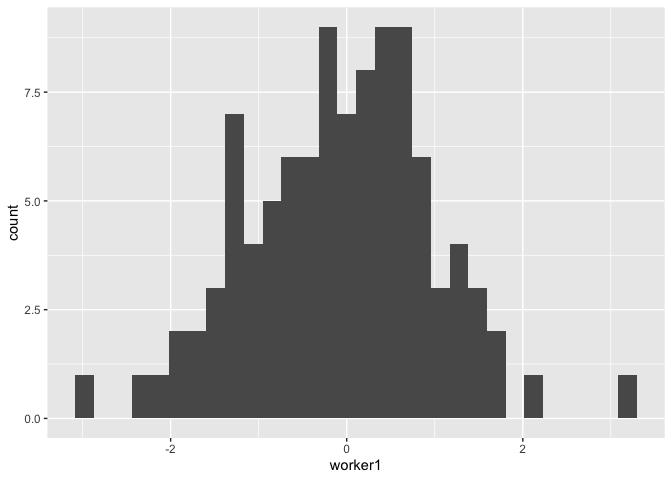

Week 2, Session 1
================

## The Motivation Tactics Puzzle

Let’s first load the data for the puzzle:

``` r
data_path = "~/Dropbox/McGill/teaching/2022-2023/ORGB690/data/"
performance_data <- read_csv(paste0(data_path,"performance_data.csv"))
```

    ## Rows: 100 Columns: 7
    ## ── Column specification ────────────────────────────────────────────────────────
    ## Delimiter: ","
    ## chr (3): w1_intervention, w2_intervention, w3_intervention
    ## dbl (4): day, worker1, worker2, worker3
    ## 
    ## ℹ Use `spec()` to retrieve the full column specification for this data.
    ## ℹ Specify the column types or set `show_col_types = FALSE` to quiet this message.

``` r
performance_data
```

    ## # A tibble: 100 × 7
    ##      day worker1 w1_intervention  worker2 w2_intervention  worker3
    ##    <dbl>   <dbl> <chr>              <dbl> <chr>              <dbl>
    ##  1     1 -1.28   None             0.639   None             0.643  
    ##  2     2  1.41   None            -0.0664  None             0.366  
    ##  3     3  0.353  None             0.0245  None             0.553  
    ##  4     4  0.360  None            -0.836   None             1.31   
    ##  5     5 -0.650  None            -0.00423 None            -0.00580
    ##  6     6  1.71   None            -1.16    None            -0.442  
    ##  7     7 -0.326  None            -0.297   None             0.468  
    ##  8     8  0.0118 None            -1.08    None             0.0172 
    ##  9     9  0.248  None            -0.396   None             1.31   
    ## 10    10  0.224  None             3.43    A                0.382  
    ## # ℹ 90 more rows
    ## # ℹ 1 more variable: w3_intervention <chr>

### Analyze the data

1.  Plot the distribution of performance for worker 1.

``` r
summary(performance_data)
```

    ##       day            worker1         w1_intervention       worker2        
    ##  Min.   :  1.00   Min.   :-2.90994   Length:100         Min.   :-3.06956  
    ##  1st Qu.: 25.75   1st Qu.:-0.76691   Class :character   1st Qu.:-0.75374  
    ##  Median : 50.50   Median : 0.01285   Mode  :character   Median : 0.01418  
    ##  Mean   : 50.50   Mean   :-0.06214                      Mean   : 0.03260  
    ##  3rd Qu.: 75.25   3rd Qu.: 0.66558                      3rd Qu.: 0.84170  
    ##  Max.   :100.00   Max.   : 3.25155                      Max.   : 3.42847  
    ##  w2_intervention       worker3          w3_intervention   
    ##  Length:100         Min.   :-2.469278   Length:100        
    ##  Class :character   1st Qu.:-0.887326   Class :character  
    ##  Mode  :character   Median : 0.002095   Mode  :character  
    ##                     Mean   :-0.119809                     
    ##                     3rd Qu.: 0.664347                     
    ##                     Max.   : 2.219876

``` r
library(ggplot2)

ggplot(data = performance_data) +
  geom_histogram(aes(x = worker1))
```

    ## `stat_bin()` using `bins = 30`. Pick better value with `binwidth`.

<!-- -->
