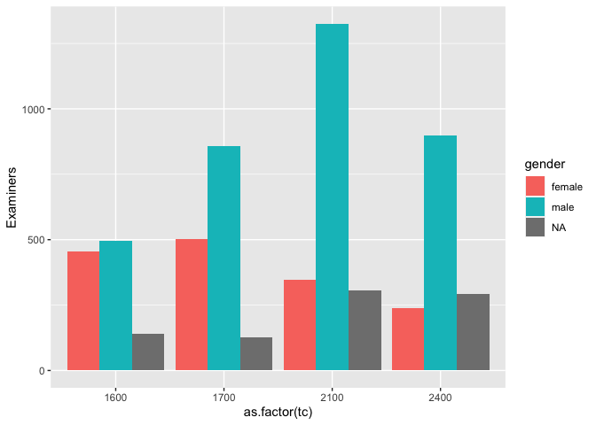

Week 3, Session 1
================

## Prepare the dataset

Run the code from the “starter” script I have shared, all in one go.
We’ll save it at the end of this chunk, to save time in future
exercises.

``` r
# change to your own path!
data_path <- "~/Dropbox/McGill/teaching/2022-2023/ORGB690/data/"
applications <- read_parquet(paste0(data_path,"app_data_sample.parquet"))

library(gender)
#install_genderdata_package() # only run this line the first time you use the package, to get data for it

# get a list of first names without repetitions
examiner_names <- applications |> 
  distinct(examiner_name_first)

# get a table of names and gender
examiner_names_gender <- examiner_names |> 
  do(results = gender(.$examiner_name_first, method = "ssa")) |> 
  unnest(cols = c(results), keep_empty = TRUE) |> 
  select(
    examiner_name_first = name,
    gender,
    proportion_female
  ) |> 
  select(examiner_name_first, gender)

# joining gender back to the dataset
applications <- applications |> 
  left_join(examiner_names_gender, by = "examiner_name_first")

# cleaning up
rm(examiner_names)
rm(examiner_names_gender)
gc()
```

    ##            used  (Mb) gc trigger  (Mb) limit (Mb) max used  (Mb)
    ## Ncells  4441305 237.2    7872987 420.5         NA  4460865 238.3
    ## Vcells 49380761 376.8   92845866 708.4      32768 79696610 608.1

``` r
## Get race
library(wru)

examiner_surnames <- applications |> 
  select(surname = examiner_name_last) |> 
  distinct()

examiner_race <- predict_race(voter.file = examiner_surnames, surname.only = T) |> 
  as_tibble() |> 
  mutate(max_race_p = pmax(pred.asi, pred.bla, pred.his, pred.oth, pred.whi)) |> 
  mutate(race = case_when(
    max_race_p == pred.asi ~ "Asian",
    max_race_p == pred.bla ~ "black",
    max_race_p == pred.his ~ "Hispanic",
    max_race_p == pred.oth ~ "other",
    max_race_p == pred.whi ~ "white",
    TRUE ~ NA_character_
  )) |> 
  select(surname,race)
```

    ## Warning: Unknown or uninitialised column: `state`.

    ## Proceeding with last name predictions...

    ## ℹ All local files already up-to-date!

    ## 701 (18.4%) individuals' last names were not matched.

``` r
applications <- applications |> 
  left_join(examiner_race, by = c("examiner_name_last" = "surname"))

rm(examiner_race)
rm(examiner_surnames)
gc()
```

    ##            used  (Mb) gc trigger  (Mb) limit (Mb) max used  (Mb)
    ## Ncells  4626839 247.1    7872987 420.5         NA  6799355 363.2
    ## Vcells 51724824 394.7   92845866 708.4      32768 91702812 699.7

``` r
## Get tenure
library(lubridate) # to work with dates

examiner_dates <- applications |> 
  select(examiner_id, filing_date, appl_status_date) |> 
  mutate(start_date = ymd(filing_date), end_date = as_date(dmy_hms(appl_status_date))) |> 
  group_by(examiner_id) |> 
  summarise(
    earliest_date = min(start_date, na.rm = TRUE), 
    latest_date = max(end_date, na.rm = TRUE),
    tenure_days = interval(earliest_date, latest_date) %/% days(1)
    ) 

## Join back to applications
applications <- applications |> 
  left_join(examiner_dates, by = "examiner_id")

rm(examiner_dates)
gc()
```

    ##            used  (Mb) gc trigger  (Mb) limit (Mb)  max used  (Mb)
    ## Ncells  4635480 247.6    7872987 420.5         NA   7872987 420.5
    ## Vcells 57800133 441.0  111495039 850.7      32768 111168120 848.2

``` r
## write out to file, to save time in future exercises
write_feather(applications, paste0(data_path,"app_data_starter.feather"))
```

## Look at examiners demographics

The first thing to note here is that our unit of interest is an
*examiner*, but our data is at the level of a *patent application*.
Examiners work with many patent applications during their tenure at the
USPTO. Those who have longer tenure in our sample will have worked on
more applications, and so if we cound the number of *records* with
attributes `male` or `female`, we will overcount those who have worked
there longer.

We may be better off creating a separate table—a.k.a. a
*dataframe*—where there is only one record per examiner. In other words,
we need to “collapse” the applications data, with multiple records per
examiner, to examiner-level data, where we only have one record per
individual.

``` r
library(dplyr)

applications %>%
  distinct(examiner_id) %>%
  count()
```

    ## # A tibble: 1 × 1
    ##       n
    ##   <int>
    ## 1  5649

### Compare TCs by gender graphically

This is what chatGPT gave us:

``` r
library(dplyr)
library(ggplot2)

applications %>%
  group_by(tc, gender) %>%
  #filter(!is.na(gender)) %>%
  summarise(n = n_distinct(examiner_id)) %>%
  ggplot(aes(x = as.factor(tc), y = n, fill = gender)) +
  geom_col(position = "dodge") +
  ylab("Examiners")
```

    ## `summarise()` has grouped output by 'tc'. You can override using the `.groups`
    ## argument.

<!-- -->

## Correlations

We have tenure for each person and we want to know whether tenure is
predicted by gender.

``` r
library(dplyr)

examiners <- applications %>%
  group_by(examiner_id) %>%
  summarise(
    tenure = first(tenure_days), 
    gender = first(gender),
    race = first(race)
    )

library(broom)

fit <- lm(tenure ~ gender + race, data = examiners)
tidy(fit)
```

    ## # A tibble: 6 × 5
    ##   term         estimate std.error statistic p.value
    ##   <chr>           <dbl>     <dbl>     <dbl>   <dbl>
    ## 1 (Intercept)     3658.     1838.    1.99   0.0466 
    ## 2 gendermale      1016.     1587.    0.640  0.522  
    ## 3 raceblack      13461.     4209.    3.20   0.00139
    ## 4 raceHispanic    -399.     3873.   -0.103  0.918  
    ## 5 raceother        894.    36030.    0.0248 0.980  
    ## 6 racewhite       1176.     1721.    0.683  0.494
